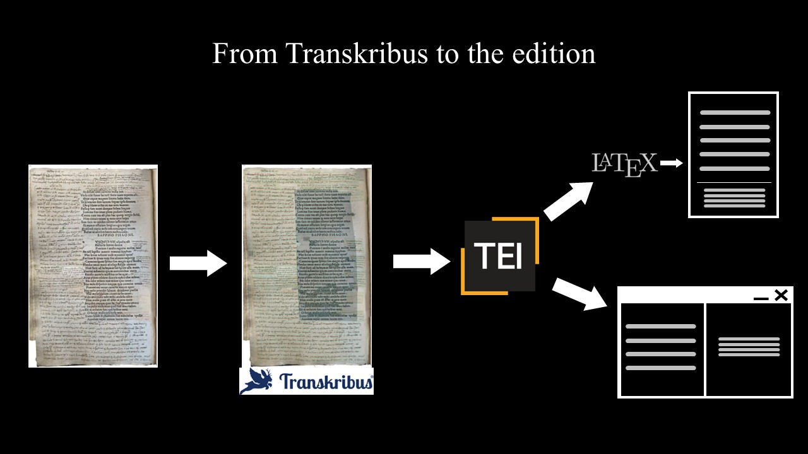

# Pipeline

I followed these passages for the developing of the DSE and the traditional edition of the text:
1. I used *Transkribus* (© ReadCoop) for the semantic annotation of layout and of the text. 
2. I exported the TEI output of my work from *Transkribus* platform 
3. I transformed the Transkribus TEI output in a regular TEI XML (according to the most updated guidelines) using XSLT sheets in compliance eith the EVT standards (from `./XSLT/01-create_div.xsl`to `.XSLT/05-regularize_ref_cit.xsl`).
4. I exported a LaTEX file from TEI XML encoding (`06-LaTEX_export.xsl`).

