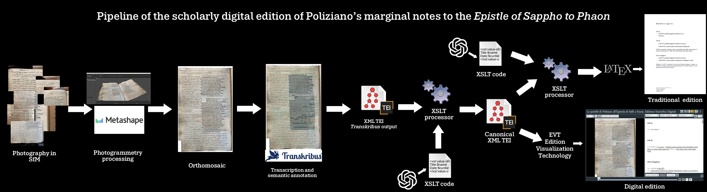

# Pipeline

I followed these passages for the developing of the XML TEI encoding of the text:
1. I used *Transkribus* (© ReadCoop) for the semantic annotation of layout and of the text. 
2. I exported the TEI output of my work from *Transkribus* platform. 
3. I transformed the Transkribus TEI output in a regular TEI XML (according to the most updated guidelines) in compliance with the EVT standards (using XSLT from `./XSLT/01-regularize_TEI.xsl`to `.XSLT/05-regularize_ref_cit.xsl`)
4. I manually editing the encoding also adding new information.
5. I exported a LaTeX file from TEI XML encoding (using XSLT `06-LaTEX_export.xsl`).

